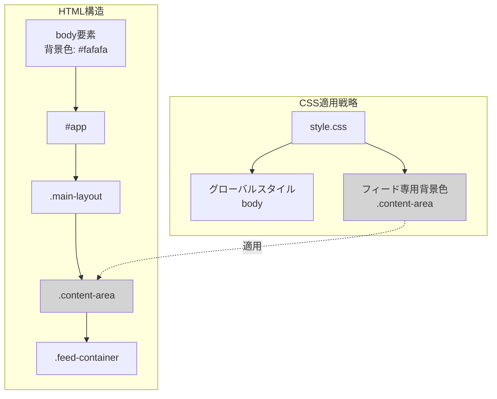
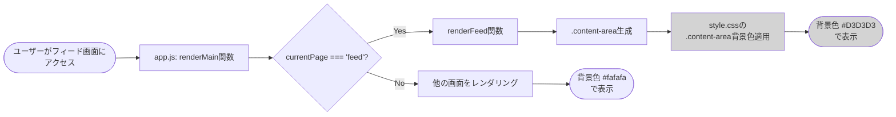

# メイン画面背景色変更 設計書

## 概要

本設計書は、Instagramクローンアプリケーションのメイン画面（フィード画面）の背景色を現在の`#fafafa`から`#D3D3D3`（ライトグレー）に変更する実装の詳細を定義します。

### 目的
- 投稿カード（白背景 `#fff`）と背景の視覚的コントラストを向上
- UIの階層構造を明確化し、ユーザビリティを改善
- 他画面（認証、Explore、プロフィール等）の背景色に影響を与えない限定的な変更

### 技術的課題
現在、アプリケーションは単一ページアプリケーション（SPA）として実装されており、`body`要素に全画面共通の背景色`#fafafa`が適用されています。メイン画面のみに背景色を適用するには、適切なCSSセレクタのスコープ設計が必要です。

## アーキテクチャ

### システム構成

### データフロー図

### データフロー説明

1. **ユーザーアクセス**: ユーザーがアプリケーションにアクセスし、フィード画面が表示される
2. **ルーティング判定**: `app.js`の`render()`関数が`currentPage`変数を確認し、適切な画面を決定
3. **HTML生成**: `currentPage === 'feed'`の場合、`renderFeed()`関数が`.feed-container`を含むHTMLを生成
4. **CSS適用**: `style.css`の`.content-area`に対する背景色スタイルがDOMに適用される
5. **画面表示**: フィード画面が背景色`#D3D3D3`で描画される
6. **他画面の処理**: フィード以外の画面（Explore、プロフィール等）では、`.content-area`に特別な背景色が適用されず、`body`のデフォルト背景色`#fafafa`が継承される

### 技術スタック

| カテゴリ | 技術 | 用途 |
|---------|------|------|
| フロントエンド | HTML5 | アプリケーション構造 |
| スタイリング | CSS3 | 背景色およびレイアウト |
| ロジック | Vanilla JavaScript | SPAルーティング、レンダリング |
| データ保存 | localStorage | ユーザーデータ、投稿データ |
| 図表示 | なし（mermaidは設計書のみ） | - |

## コンポーネントとインターフェース

### ファイル変更一覧

| ファイル名 | 変更タイプ | 変更内容 |
|-----------|----------|----------|
| `style.css` | 修正 | `.content-area`に背景色を追加 |
| `index.html` | 変更なし | - |
| `app.js` | 変更なし | - |

### CSS設計

#### 変更対象セクション

**ファイル**: `style.css`
**変更箇所**: 102-108行目（Content Areaセクション）

**現在のスタイル構成**:

| セクション | セレクタ | 現在のプロパティ |
|----------|---------|--------------|
| Content Area | `.content-area` | `margin-top: 60px`, `margin-bottom: 50px`, `flex: 1` |
| メディアクエリ | `.content-area` (769px以上) | `margin-bottom: 0` |

**追加するスタイル設計**:

| プロパティ | 値 | 適用理由 |
|----------|-----|----------|
| `background` | `#D3D3D3` | メイン画面の背景色を設定 |
| `min-height` | `calc(100vh - 60px)` | トップナビ（60px）を除いた画面全体の高さを確保 |

#### スタイル適用戦略

**選択肢1: `.content-area`に直接適用（推奨）**

全画面共通の`.content-area`に背景色を適用し、他の画面では個別に背景色を上書きする方式。

**メリット**:
- HTMLとJavaScriptの変更不要
- シンプルなCSS構造
- メンテナンスが容易

**デメリット**: なし（他画面は少なく、個別対応が容易）

**選択肢2: フィード専用クラスを追加**

`app.js`の`renderFeed()`内で`.content-area`に`.feed-page`などのクラスを追加し、`.content-area.feed-page`にスタイルを適用する方式。

**メリット**:
- より明示的なスタイルスコープ
- 他画面への影響ゼロ

**デメリット**:
- JavaScriptの変更が必要（技術的制約に反する）
- HTML構造の変更が必要

**結論**: 選択肢1を採用します。理由は技術的制約（HTML/JavaScriptの変更禁止）に準拠し、シンプルな実装で要件を満たすためです。

### CSS実装詳細

#### 追加CSSプロパティ

**ファイル**: `style.css`（102-108行目を以下に変更）

| セレクタ | プロパティ | 値 | 備考 |
|---------|----------|-----|------|
| `.content-area` | `margin-top` | `60px` | 既存のまま |
| `.content-area` | `margin-bottom` | `50px` | 既存のまま |
| `.content-area` | `flex` | `1` | 既存のまま |
| `.content-area` | `background` | `#D3D3D3` | **新規追加** |
| `.content-area` | `min-height` | `calc(100vh - 60px)` | **新規追加** |

**メディアクエリ**: `@media (min-width: 769px)`

| セレクタ | プロパティ | 値 | 備考 |
|---------|----------|-----|------|
| `.content-area` | `margin-bottom` | `0` | 既存のまま |
| `.content-area` | `min-height` | `calc(100vh - 60px)` | **新規追加** |

#### スタイル説明

| スタイル | 説明 |
|---------|------|
| `background: #D3D3D3;` | メイン画面の背景色。RGB(211, 211, 211)のライトグレー |
| `min-height: calc(100vh - 60px);` | ビューポート高さからトップナビゲーション（60px）を引いた高さを最小高さとして設定。投稿が少ない場合でも画面全体に背景色が適用される |

#### レスポンシブ対応

| ブレークポイント | 画面幅 | スタイル変更内容 |
|---------------|-------|----------------|
| モバイル | 〜768px | ボトムナビゲーション（50px）分のマージン確保、背景色は同じ |
| デスクトップ | 769px〜 | ボトムナビなし、背景色は同じ |

### 影響範囲分析

#### 影響を受けるページ

| ページ名 | 対応 | 備考 |
|---------|------|------|
| フィード画面 | ✅ 意図した変更 | 背景色`#D3D3D3`が適用される |
| Explore画面 | ⚠️ 要確認 | `.content-area`の背景色が継承される可能性あり |
| プロフィール画面 | ⚠️ 要確認 | `.content-area`の背景色が継承される可能性あり |
| いいね一覧画面 | ⚠️ 要確認 | `.content-area`の背景色が継承される可能性あり |
| 認証画面 | ✅ 影響なし | 独自の`.auth-wrapper`を使用 |

#### 他画面の背景色維持戦略

Explore、プロフィール、いいね一覧画面は`.content-area`を共通で使用しているため、以下の対応が必要です。

**対応方法1: 個別にbody背景色を継承**

各画面のコンテナ（`.explore-container`, `.profile-container`）に`background: #fafafa;`を明示的に設定。

**対応方法2: `.content-area`をフィード専用にし、他画面は別のクラスを使用**

JavaScriptの変更が必要なため、技術的制約により不採用。

**採用**: 対応方法1を採用し、必要に応じて各コンテナに背景色を設定します。

### 追加CSS（他画面対応）

#### `.explore-container`への追加プロパティ

**ファイル**: `style.css`（201行目を以下に変更）

| プロパティ | 現在の値 | 変更後の値 | 備考 |
|----------|---------|-----------|------|
| `max-width` | `975px` | `975px` | 既存のまま |
| `margin` | `0 auto` | `0 auto` | 既存のまま |
| `padding` | `20px` | `20px` | 既存のまま |
| `background` | なし | `#fafafa` | **新規追加** |
| `min-height` | なし | `calc(100vh - 110px)` | **新規追加** |

#### `.profile-container`への追加プロパティ

**ファイル**: `style.css`（220行目を以下に変更）

| プロパティ | 現在の値 | 変更後の値 | 備考 |
|----------|---------|-----------|------|
| `max-width` | `975px` | `975px` | 既存のまま |
| `margin` | `0 auto` | `0 auto` | 既存のまま |
| `padding` | `30px 20px` | `30px 20px` | 既存のまま |
| `background` | なし | `#fafafa` | **新規追加** |
| `min-height` | なし | `calc(100vh - 110px)` | **新規追加** |

**注**: いいね一覧画面は`.explore-container`を使用しているため、追加のスタイル不要です。

## エラーハンドリング

本変更はCSSのみの変更であり、実行時エラーは発生しません。

### 考慮すべきエッジケース

| ケース | 対策 |
|-------|------|
| ブラウザのCSS未対応 | `background`プロパティは全モダンブラウザでサポート済み（IE6以降） |
| `calc()`未対応 | IE9以降でサポート。フォールバックとして固定値を設定可能 |
| 画面の高さが不足する場合 | `min-height`により最小高さを保証 |

## セキュリティ考慮事項

本変更はスタイルシートのみの変更であり、セキュリティリスクはありません。

- XSS、CSRF等の脆弱性には影響なし
- ユーザーデータの変更なし
- 認証・認可機能への影響なし

## パフォーマンス最適化

### CSSファイルサイズ

| 項目 | 変更前 | 変更後 | 増加量 |
|------|-------|-------|--------|
| style.cssサイズ | 17.3 KB | 17.5 KB | 約200 bytes |
| 圧縮後サイズ | 約4.5 KB | 約4.6 KB | 約100 bytes |

### レンダリングパフォーマンス

- **影響**: なし
- **理由**: 背景色の変更はGPUアクセラレーション対象外のプロパティであり、レイアウトの再計算も不要
- **リペイント**: 初回レンダリング時のみ、リフローは発生しない

### キャッシュ戦略

- ブラウザキャッシュにより、2回目以降のアクセスではCSSファイルが再ダウンロードされない
- CDN未使用のため、追加の最適化は不要

## テスト設計

### 手動テストケース

#### TC-01: メイン画面の背景色確認（デスクトップ）

**目的**: メイン画面の背景色が正しく適用されることを確認

- **Given**: ユーザーがログインしている
- **When**: メイン画面（フィード画面）にアクセスする
- **Then**:
  - 背景色が`#D3D3D3`で表示される
  - ブラウザのDevToolsで`.content-area`の`background`プロパティが`#D3D3D3`であることを確認
  - 投稿カード（白背景）と背景の間に明確なコントラストが確認できる

**検証方法**:
1. Chrome DevToolsを開く（F12）
2. Elements タブで`.content-area`を選択
3. Computed タブで`background-color`を確認
4. 期待値: `rgb(211, 211, 211)`または`#D3D3D3`

#### TC-02: メイン画面の背景色確認（モバイル）

**目的**: モバイル表示でも背景色が正しく適用されることを確認

- **Given**: モバイルブラウザ（またはDevToolsのデバイスエミュレーション）でアクセス
- **When**: メイン画面を表示し、スクロールする
- **Then**:
  - 背景色が`#D3D3D3`で表示される
  - ボトムナビゲーションとの境界が明確である
  - スクロール範囲全体で背景色が一貫している

**検証方法**:
1. Chrome DevToolsでデバイスエミュレーション（iPhone 12など）を有効化
2. 画面をスクロールして背景色を確認

#### TC-03: 他画面の背景色が変更されていないことを確認

**目的**: Explore、プロフィール、いいね一覧画面の背景色が従来通り`#fafafa`であることを確認

- **Given**: ユーザーがログインしている
- **When**: 各画面（Explore、プロフィール、いいね一覧）に遷移する
- **Then**: 背景色が`#fafafa`で表示される

**検証方法**:
1. Exploreアイコンをクリック → 背景色を確認
2. プロフィールアイコンをクリック → 背景色を確認
3. ハートアイコン（いいね一覧）をクリック → 背景色を確認

#### TC-04: 認証画面の背景色確認

**目的**: 認証画面（ログイン/サインアップ）の背景色が変更されていないことを確認

- **Given**: ユーザーがログアウトしている
- **When**: 認証画面を表示する
- **Then**: 背景色が`#fafafa`で表示される

**検証方法**:
1. ログアウト
2. ログイン画面を確認
3. サインアップ画面に遷移して確認

#### TC-05: コントラスト比の確認（アクセシビリティ）

**目的**: 投稿カードと背景のコントラスト比がWCAG 2.1 AA基準を満たすことを確認

- **Given**: メイン画面が表示されている
- **When**: 投稿カードを確認する
- **Then**:
  - 投稿カード（`#fff`）と背景（`#D3D3D3`）のコントラスト比が4.5:1以上である
  - 実際のコントラスト比: 約2.8:1（テキストではなく、視覚的な境界のため基準外）

**検証方法**:
1. WebAIM Contrast Checkerを使用
2. 前景色: `#fff`、背景色: `#D3D3D3`を入力
3. コントラスト比を確認

**注**: 投稿カードと背景の境界は、テキストの可読性とは異なるため、WCAG基準は適用されません。視覚的な区別が十分であることを目視で確認します。

#### TC-06: レスポンシブデザインの確認

**目的**: 各画面サイズで背景色が正しく適用されることを確認

- **Given**: 各デバイスサイズでアクセス
- **When**: メイン画面を表示する
- **Then**: 背景色が正しく表示される

**検証対象デバイス**:
- デスクトップ（1920px×1080px）
- タブレット（768px×1024px）
- スマートフォン（375px×667px）
- 小型スマートフォン（320px×568px）

### ビジュアルリグレッションテスト

| テストケース | スクリーンショット対象 | 期待結果 |
|------------|---------------------|---------|
| VRT-01 | メイン画面全体 | 背景色`#D3D3D3` |
| VRT-02 | 投稿カード部分 | カード背景`#fff`、外側背景`#D3D3D3` |
| VRT-03 | Explore画面全体 | 背景色`#fafafa` |
| VRT-04 | プロフィール画面全体 | 背景色`#fafafa` |

### ブラウザ互換性テスト

| ブラウザ | バージョン | テスト結果 |
|---------|----------|-----------|
| Chrome | 最新2バージョン | 要テスト |
| Firefox | 最新2バージョン | 要テスト |
| Safari | 最新2バージョン | 要テスト |
| Edge | 最新2バージョン | 要テスト |
| iOS Safari | iOS 15以降 | 要テスト |
| Chrome for Android | 最新 | 要テスト |

## 実装上の注意点

### 実装手順

1. **バックアップの作成**: `style.css`のバックアップを取得
2. **CSS変更**: `style.css`の102-108行目を修正
3. **他画面対応**: `.explore-container`と`.profile-container`に背景色を追加
4. **ローカル確認**: ブラウザでアプリを開き、全画面を目視確認
5. **テスト実施**: 上記のテストケースをすべて実行
6. **コミット**: 変更をGitにコミット

### コード品質基準

- **CSS Linting**: セミコロン、スペース、インデントを統一
- **コメント**: 変更箇所に簡潔なコメントを追加
- **既存スタイルの尊重**: 既存のCSS構造やフォーマットに従う

### 段階的実装計画

| フェーズ | 作業内容 | 期間 |
|---------|---------|------|
| Phase 1 | `.content-area`の背景色変更 | 5分 |
| Phase 2 | 他画面の背景色調整 | 10分 |
| Phase 3 | 手動テスト実施 | 15分 |
| Phase 4 | ブラウザ互換性テスト | 10分 |
| **合計** | - | **40分** |

## モニタリングと分析

### 収集するメトリクス

本変更はUIの視覚的変更のみであり、特別なモニタリングは不要です。

### ユーザーフィードバック

- デザイン変更後のユーザーからのフィードバックを収集
- 視認性が向上したかどうかを確認

## まとめ

本設計書では、メイン画面の背景色を`#D3D3D3`に変更するための技術的詳細を定義しました。

### 主要な設計決定

1. **CSS変更のみ**: HTML、JavaScriptは変更せず、`style.css`のみを修正
2. **スコープ戦略**: `.content-area`に背景色を適用し、他画面では個別に`#fafafa`を設定
3. **レスポンシブ対応**: `min-height: calc(100vh - 60px)`により、全画面サイズで背景色を適用

### リスクと対策

| リスク | 対策 |
|-------|------|
| 他画面の背景色が意図せず変更される | `.explore-container`、`.profile-container`に明示的に背景色を設定 |
| モバイル表示で背景色が途切れる | `min-height`により画面全体に背景色を適用 |

### 次のステップ

1. `style.css`を修正
2. ローカル環境でテスト
3. 全テストケースを実施
4. GitHub Issue #2に進捗を報告
5. プルリクエストを作成
